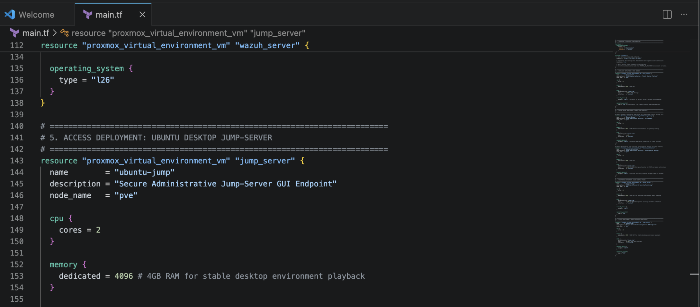
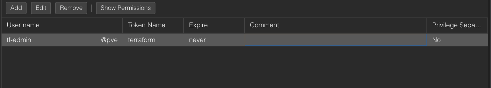
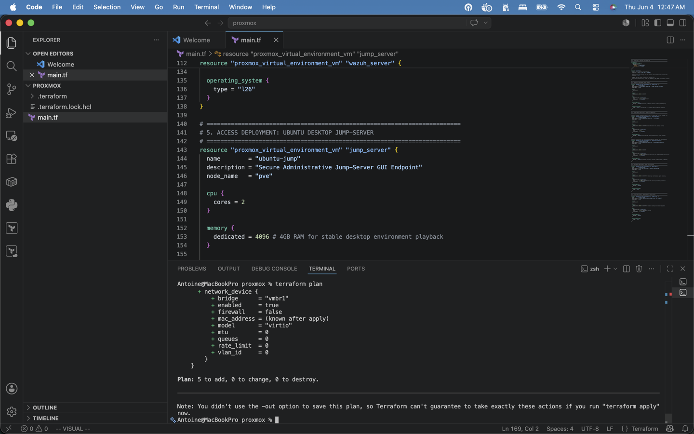
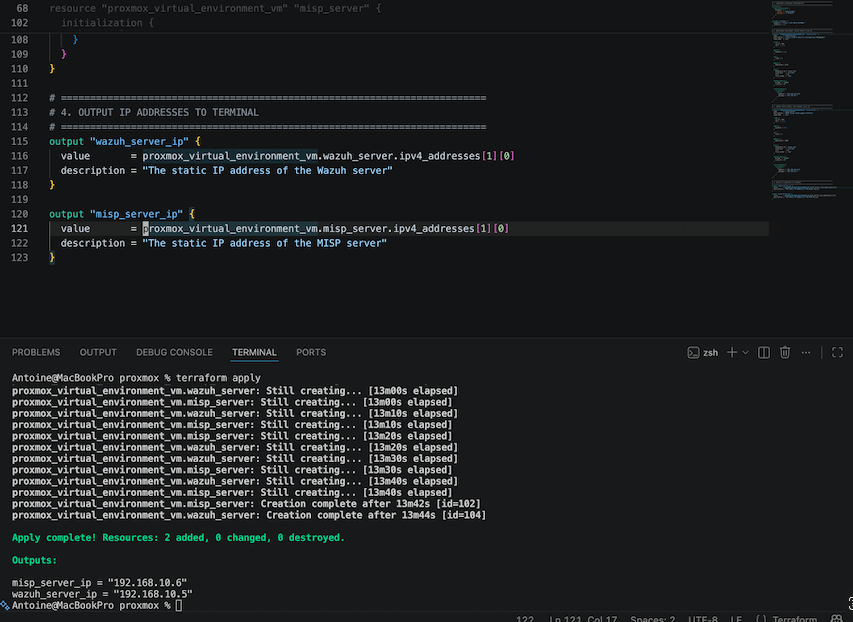

# Proxmox Homelab Infrastructure as Code (Terraform)



## Background
This repository contains the Terraform configuration used to provision and manage my home cyber lab. I utilize Proxmox VE as a bare-metal hypervisor, and as my infrastructure scaled to include advanced security tools like Wazuh (SIEM) and MISP (Threat Intelligence), manual provisioning became inefficient. I adopted Terraform to fully automate the deployment of my network security lab, ensuring consistency, repeatability, and version control across all my environments.

## Key Benefits of Usage
*   **Human-Readable Language:** HashiCorp Configuration Language (HCL) is human-readable, making it easy to learn, write, and understand what the code is doing without needing a deep background in software development.
*   **Infrastructure as Code (IaC):** Allows for version-controlling the entire Proxmox data center setup.
*   **Rapid Provisioning:** Enables spinning up complex, multi-VLAN environments (like a Wazuh and MISP stack) in minutes rather than hours.
*   **State Management:** Keeps track of the exact state of deployed resources, making updates and teardowns clean and predictable.

## Prerequisites and Setup

Before running the code in this repository, you must configure Proxmox to accept API calls from Terraform.

1.  Create a dedicated user and role in Proxmox for Terraform.
2.  Generate an API Token for that user.



3.  Create an `.env` file in the root directory to store your credentials locally (ensure this file is in your `.gitignore` to protect your tokens):

```bash
export TF_VAR_proxmox_endpoint="[https://192.168.0.20:8006/](https://192.168.0.20:8006/)"
export PROXMOX_VE_API_TOKEN="your_token_id=your_token_secret"
```
## How to Use

1.  **Initialize the Directory:**
    Downloads the necessary providers (like `bpg/proxmox`).
    ```bash
    terraform init
    ```

2.  **Load Environment Variables:**
    Source your `.env` file to load your API credentials and endpoints into your active terminal session.
    
    ```bash
    source .env
    ```

3.  **Review the Execution Plan:**
    Generates a speculative plan showing exactly what resources will be created, modified, or destroyed.
    ```bash
    terraform plan
    ```
    

4.  **Apply the Configuration:**
    Deploys the infrastructure to your Proxmox server.
    ```bash
    terraform apply
    ```
    

## Tips and Tricks
*   **Use Templates:** I utilize full clones of an existing Cloud-Init template (VM ID `905`) to speed up deployment times for my servers.
*   **Variable Shared Network Settings:** While I hardcode static IP addresses specific to the services (like `192.168.10.5` for Wazuh), passing the VLAN IDs and gateway addresses as variables makes adapting to network changes easier.
*   **The bpg/proxmox Provider:** Using the `bpg/proxmox` provider over older alternatives offers better stability and feature support for modern Proxmox VE environments.

## Lessons Learned
*   **Protecting State Files:** Terraform state files (`.tfstate`) contain sensitive data like plain-text API keys and internal IP structures. These must always be added to the `.gitignore` file and never committed to a public repository.
*   **Bare-Metal Hypervisor Nuances:** Operating on Proxmox VE as a bare-metal hypervisor requires careful attention to datastores (like `local-lvm`) and bridge interfaces (`vmbr0`) when defining resources, unlike standard desktop hypervisors.
*   **Modular Thinking:** Moving from a single monolithic `main.tf` to a structured directory drastically improves the readability of the project.